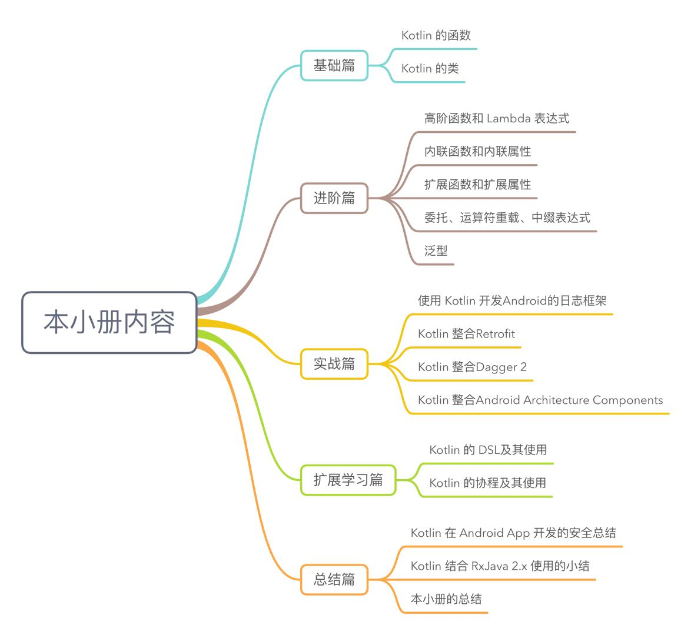

# kotlin_tutorial

此 repository 是本人掘金的小册《Android 进阶：基于 Kotlin 的 Android App 开发实践》中的相关的例子。

小册主要内容：

小册地址：https://juejin.im/book/5af1c5ee6fb9a07a9f018368

# 各小节的例子

## 一. 基础篇

Basic 是Java工程，使用IntelliJ Idea打开。

### 1.1 Kotlin 的函数

| 类名      |      用途    |  备注 |
|----------|-------------|------|
|Args1.kt|可变数量的参数的演示|
|Args2.kt|使用展开运算符`*`解包数组|
|Args3.kt|如果可变参数不是函数的最后一个参数，后面的参数需要通过命名参数来传值|
|Nothing.kt|Nothing 类型的演示|
|LocalFunction.kt|局部函数的演示|
|Recursive.kt|普通的尾递归函数|
|TailRecursive.kt|使用 tailrec 关键词的尾递归函数|
|Main.kt|无参 main 函数|

### 1.2 Kotlin 的类

| 类名      |      用途    |  备注 |
|----------|-------------|------|
|Constructor1.kt|使用主构造函数和 init 初始化块|在classes包下
|Constructor2.kt|使用 constructor 关键字作为构造函数的函数名|在classes包下
|Constructor3.kt|使用主、次构造函数|在classes包下
|Constructor4.kt|使用多个 init 初始化块|在classes包下
|OutterAndNested.kt|嵌套类的演示|在classes包下
|OutterAndInner.kt|内部类的演示|在classes包下
|Color.kt|枚举类的演示|在classes包下
|Singleton1.kt|使用对象声明实现单例模式|在classes包下
|Singleton2.kt|使用伴生对象实现单例模式|在classes包下
|CompanionObject.kt|伴生对象的演示|在classes包下
|DataClass.kt|数据类的演示|在classes包下
|SealedClass.kt|密封类的演示|在classes包下

## 二. 进阶篇

Basic 是Java工程，使用IntelliJ Idea打开。

### 2.1 高阶函数和Lambda表达式

| 类名      |      用途    |  备注 |
|----------|-------------|------|
|HigherOrderFunctions1.kt|函数类型的演示|
|HigherOrderFunctions2.kt|使用高阶函数实现求和、求平方和、求立方和|
|HigherOrderFunctions3.kt|函数作为其他函数的返回值|
|Lambda.kt|filter 的使用|
|Sequence.kt|Sequence 的演示|
|MethodReference.kt|使用方法引用对 User 对象按照 name 来进行排序|
|SAM.kt|SAM 转换的演示|

### 2.2 内联函数和内联属性

| 类名      |      用途    |  备注 |
|----------|-------------|------|
|Inline.kt|使用内联函数和非内联函数的演示|
|Noinline.kt|使用 noinline 来修饰不需要内联的函数类型的参数|

### 2.3 扩展函数和扩展属性

| 类名      |      用途    |  备注 |
|----------|-------------|------|
|Extension1.kt|对 String 类增加一个 checkEmail() 函数|
|Extension2.kt|扩展函数跟原先的函数重名并且参数都相同|
|Extension3.kt|类的扩展属性的演示|
|Polymorphism.kt|Kotlin 的扩展函数不具有多态性|

### 2.4 委托、运算符重载以及中缀表达式

| 类名      |      用途    |  备注 |
|----------|-------------|------|
|Delegate.kt|Kotlin 委托模式的演示|在delegates包下
|DatabaseDelegate|创建 DatabaseDelegate 来管理 User 的属性，并模拟数据库的操作|在delegates包下
|Lazy.kt| lazy() 函数的演示|
|Invoke.kt|重载 invoke 函数的演示|
|Infix1.kt|在扩展函数中使用中缀表达式|
|Infix2.kt|在成员函数中使用中缀表达式|

## 三. 实战篇

### 3.1 Kotlin 整合网络框架

Retrofit 是Android工程，使用Android Studio打开。

Retrofit 工程中 app1 和 app2 两个module都可以编译成单独的App。

### 3.2 Kotlin 整合Dagger

Dagger2是Android工程，使用Android Studio打开。

Dagger2 工程中 app1、app2 和 app3 三个module都可以编译成单独的App。

## 四. 扩展学习篇

### 4.1 Kotlin 的DSL及其使用

DSL 是Java工程，使用IntelliJ Idea打开。

| 类名      |      用途    |  备注 |
|----------|-------------|------|
|Receiver.kt|带接收者的函数类型||
|Apply.kt|演示 apply 函数||
|UserWrapper.kt|模拟 apply 函数，创建自己第一个 DSL||
|Invoke.kt|对 String 添加一个扩展函数invoke，并结合带接收者的 Lambda 作为参数||
|Dependency.kt|模拟 Gradle 添加库的依赖||
|Assertion.kt|使用中缀表达式实现 DSL|在test目录下|

### 4.2 Kotlin 的协程及其使用
Coroutines1 是Java工程，使用IntelliJ Idea打开。

| 类名      |      用途    |  备注 |
|----------|-------------|------|
|Launch.kt|使用 launch 的 hello world 版本|
|Async1.kt|使用 async 的 hello world 版本|
|Async2.kt|使用 async 创建的协程拥有返回值|
|Async3.kt|使用 async 的 start 参数用于指定的协程何时开始|
|RunBlocking.kt|使用 runBlocking 的 hello world 版本|
|Delay.kt|挂起函数 delay() 的使用|
|Yield.kt|挂起函数 yield() 的使用|
|WithContext.kt|挂起函数 withContext 的使用|
|CoroutineScope.kt|挂起函数 coroutineScope 的使用|
|CoroutineDispatchers1.kt|创建多个协程并使用不同的协程调度器|
|CoroutineDispatchers2.kt|在使用 Unconfined 的协程，在 delay 前后，并没有运行在同一线程中。|
|ChildCoroutine1.kt|使用一个协程的 coroutineContext 来启动另一个协程，新协程的 Job 就会成为父协程 Job 的孩子。|
|ChildCoroutine2.kt|父协程会等待子协程执行完。|
|ChildCoroutine3.kt|在已有的协程中使用 GlobalScope.launch 来创建协程，并不是子协程。|
|ChildCoroutine4.kt|协程支持多个 CoroutineContext 进行+操作，使得一个协程具有多个 CoroutineContext 的特性。|
|CoroutineContext+Job.kt|如果 CoroutineContext 与 Job 对象相加，Job 对象可以直接管理该协程。|
|Channel1.kt|使用 channel 发送消息，并进行接收。|
|Channel2.kt|channel 关闭的演示。|
|Channel3.kt|channel 中采用 Pipelines 的演示。|
|Channel4.kt|创建带有缓冲区的 channel|
|Channel5.kt|在演示 channel 时，使用挂起函数 delay()|
|Actor.kt|Actor 内部是从 channel 接收消息。|
|Select.kt|Select 表达式的演示。|

Coroutines2 是Android工程，使用Android Studio打开。

## 五. 番外篇
Benchmark 是Java工程，使用IntelliJ Idea打开。

| 类名      |      用途    |  备注 |
|----------|-------------|------|
|SequenceBenchmark.kt|sequence和list经过多次链式调用后的性能比较|
|InlineBenchmark.kt|使用内联和非内联的性能比较|
|CoroutinesBenchmark.kt|使用RxJava2和Coroutines的性能比较|

# 开发工具

Android 的工程采用 Android Studio3.2 开发，gradle 版本是4.4。

Java 的工程采用 Intellij IDEA 2018.3 社区版开发。

IDEA 采用 Kotlin Plugin 版本 v1.3.10-release-IJ2018.3-1

Kotlin 版本 1.3.10

# 联系方式:
wechat：fengzhizi715

> Java与Android技术栈：每周更新推送原创技术文章，欢迎扫描下方的公众号二维码并关注，期待与您的共同成长和进步。

License
-------

    Copyright (C) 2018 - present, Tony Shen.

    Licensed under the Apache License, Version 2.0 (the "License");
    you may not use this file except in compliance with the License.
    You may obtain a copy of the License at

       http://www.apache.org/licenses/LICENSE-2.0

    Unless required by applicable law or agreed to in writing, software
    distributed under the License is distributed on an "AS IS" BASIS,
    WITHOUT WARRANTIES OR CONDITIONS OF ANY KIND, either express or implied.
    See the License for the specific language governing permissions and
    limitations under the License.
